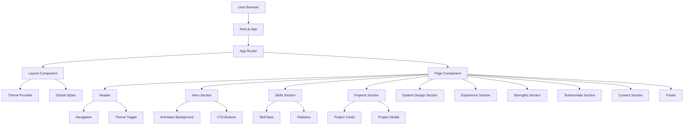
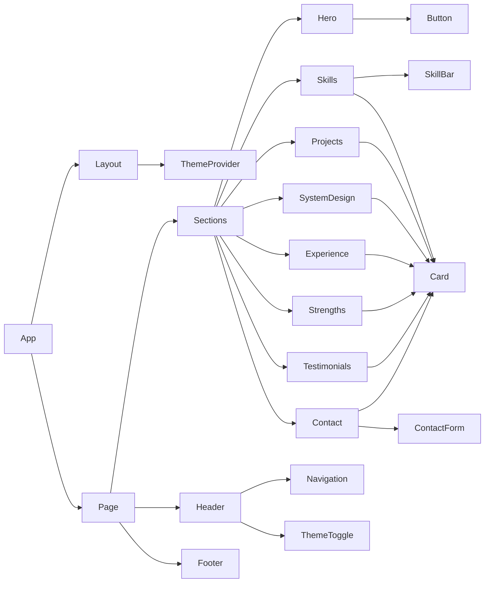
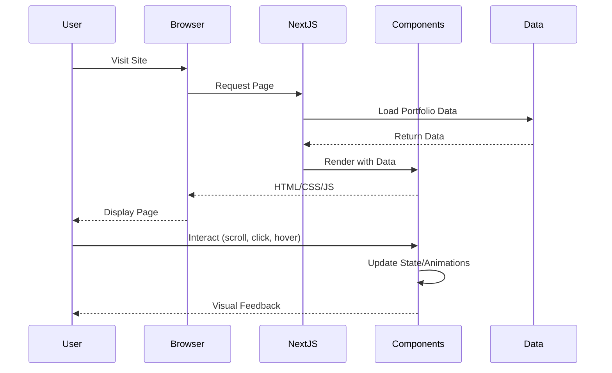
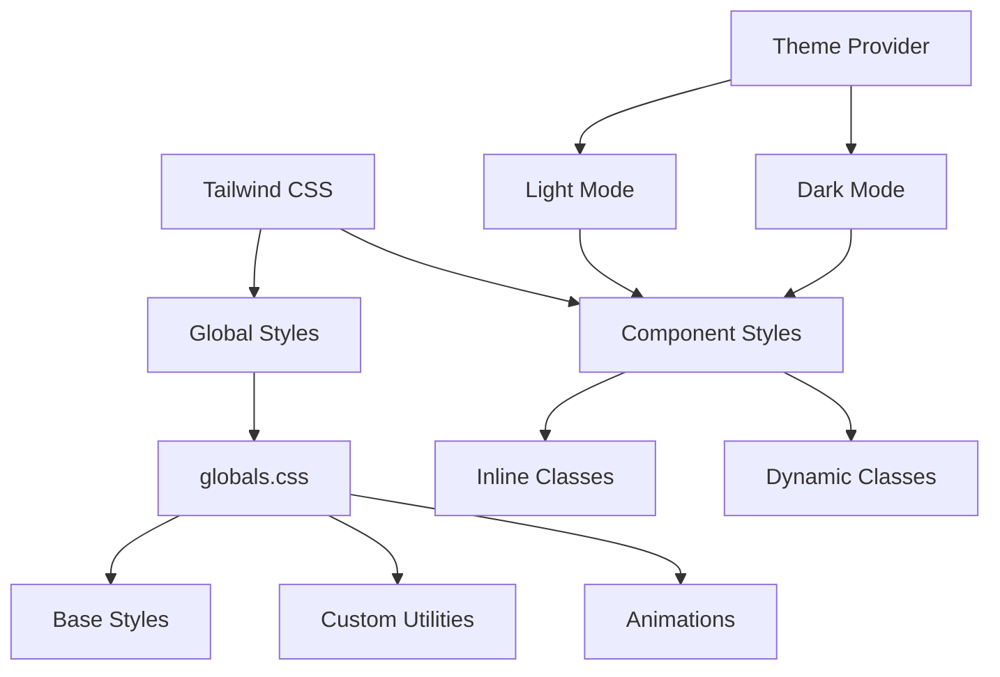
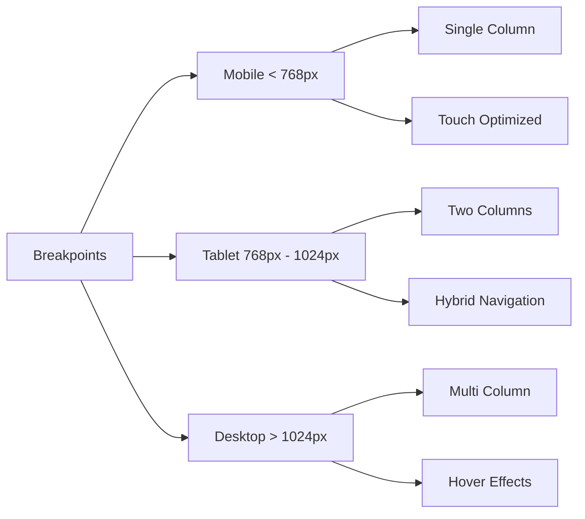
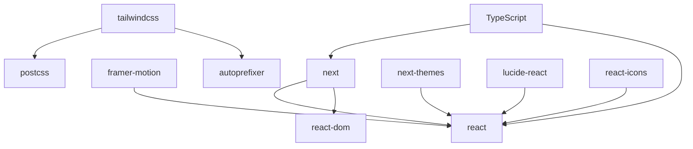
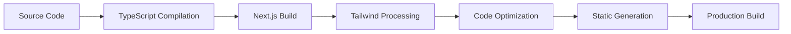
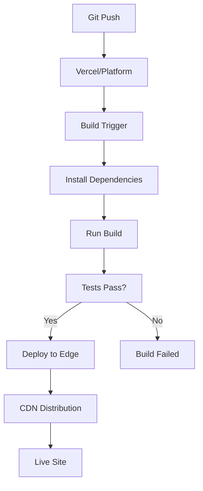

# Architecture Overview

This document provides a detailed overview of the portfolio website architecture.

## 🏗️ System Architecture

## 📦 Component Architecture

## 🗂️ Data Flow

## 🎨 Styling Architecture

## 🔄 State Management

### Theme State
- Managed by `next-themes`
- System preference detection
- Persistent storage in localStorage
- Real-time updates across components

### Form State
- Local component state (useState)
- Validation logic in component
- Error state management

### Animation State
- Managed by Framer Motion
- Viewport-based triggers
- Scroll-based animations

## 🚀 Performance Optimizations

### 1. Code Splitting
- Automatic route-based splitting by Next.js
- Dynamic imports for heavy components
- Lazy loading for images

### 2. Rendering Strategy
- Static generation for main page
- Client-side rendering for interactive components
- Optimistic UI updates

### 3. Asset Optimization
- Tailwind CSS purging
- Minification and compression
- Modern font loading

### 4. Animation Performance
- GPU-accelerated transforms
- RequestAnimationFrame usage
- Efficient re-render patterns

## 📱 Responsive Design Strategy

## 🔐 Security Considerations

### Input Validation
- Client-side form validation
- Email format validation
- XSS prevention via React

### External Links
- `rel="noopener noreferrer"` on all external links
- Target="_blank" for external navigation

### Environment Variables
- Sensitive data in .env.local
- Public variables prefixed with NEXT_PUBLIC_

## 🎯 SEO Strategy

### Meta Tags
- Dynamic title and description
- Open Graph tags
- Keyword optimization

### Semantic HTML
- Proper heading hierarchy
- ARIA labels for accessibility
- Semantic section elements

### Performance
- Fast page loads (< 3s)
- Mobile-friendly design
- Core Web Vitals optimization

## 📊 Component Dependencies

## 🔧 Build Process

### Build Steps
1. **TypeScript Compilation** - Type checking and compilation
2. **Next.js Build** - Page generation and optimization
3. **Tailwind Processing** - CSS purging and minification
4. **Code Optimization** - Tree shaking and minification
5. **Static Generation** - Pre-rendering pages
6. **Bundle Analysis** - Size optimization

## 🌐 Deployment Architecture

## 📈 Performance Metrics

### Target Metrics
- **LCP** (Largest Contentful Paint): < 2.5s
- **FID** (First Input Delay): < 100ms
- **CLS** (Cumulative Layout Shift): < 0.1
- **TTI** (Time to Interactive): < 3.8s

### Monitoring
- Lighthouse scores
- Core Web Vitals
- Real user monitoring (optional with Vercel Analytics)

## 🎭 Animation Strategy

### Animation Types
1. **Page Load** - Fade-in and slide-up effects
2. **Scroll Animations** - Viewport-based triggers
3. **Hover Effects** - Transform and scale
4. **Theme Transitions** - Smooth color changes

### Performance Considerations
- Use `transform` and `opacity` (GPU-accelerated)
- Avoid animating `width`, `height`, `top`, `left`
- Use `will-change` sparingly
- Implement `reduce-motion` media query

## 🔍 Future Architecture Considerations

### Scalability
- Headless CMS integration (Contentful, Sanity)
- API routes for dynamic content
- Database integration for blog/comments

### Advanced Features
- Server-side rendering for dynamic content
- Incremental static regeneration
- Edge functions for personalization
- Real-time updates with WebSockets

### Internationalization
- Multi-language support
- Locale-based routing
- Translated content management

---

## 📚 Technology Decisions

### Why Next.js?
- ✅ Excellent performance out of the box
- ✅ SEO-friendly with SSR/SSG
- ✅ Great developer experience
- ✅ Built-in optimization
- ✅ Easy deployment

### Why Tailwind CSS?
- ✅ Rapid development
- ✅ Consistent design system
- ✅ Small bundle size with purging
- ✅ Excellent responsive utilities
- ✅ Dark mode support

### Why Framer Motion?
- ✅ Declarative animations
- ✅ Great performance
- ✅ Powerful API
- ✅ React-first design
- ✅ Production-ready

### Why TypeScript?
- ✅ Type safety
- ✅ Better IDE support
- ✅ Catch errors early
- ✅ Self-documenting code
- ✅ Improved maintainability

---

*This architecture is designed to be scalable, performant, and maintainable.*
